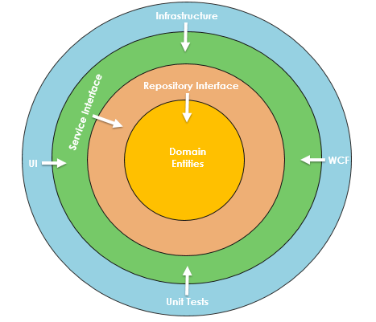
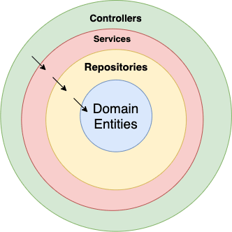

[معماری نرم افزاری]{dir="rtl"} Onion [(پیاز)]{dir="rtl"}

[مقدمه:]{dir="rtl"}

[معماری]{dir="rtl"} Onion [توسط]{dir="rtl"} Jeffrey Palermo [جهت تولید
برنامه هایی با قابلیت نگهداری، اطمینان و تست پذیری بالا معرفی
گردید]{dir="rtl"}. [این معماری چالش های رایج را با استفاده از 3
تا]{dir="rtl"} N [لایه حل میکند که هر لایه جهت ارتباط با لایه دیگر از
اینترفیس ها استفاده میکند.]{dir="rtl"}

[به طور خلاصه معماری]{dir="rtl"} onion [سبب ایجاد سیستم های جامع و کاملی
میشود که قابلیت نگهداری و تست پذیری بالایی دارند و تغییر تکنولوژی در این
سیستم ها راحت تر است.]{dir="rtl"}

**[اصول معماری]{dir="rtl"} Onion**

**[اتصال لایه ها]{dir="rtl"}**

[هدف اول این معماری اتصال لایه های سیستم با یکدیگر به گونه ای که لایه
های مختلف مانند پیاز در کنار همدیگر قرار میگیرند که لایه های بالایی
توانایی تغییر و تکامل کمتری نسبت به لایه های پایینی در سیستم را دارا می
باشند.]{dir="rtl"}

[ارتباط لایه ها به یکدیگر به صورت درونی می باشد یعنی لایه بالاتر فقط
وابستگی به لایه های درونی خود دارد و هیچ وابستگی به لایه بیرونی خود
ندارد. (شکل 1)]{dir="rtl"}

{width="5.141770559930008in"
height="4.415095144356956in"}

[شکل 1]{dir="rtl"}

**[منطق ارتباط لایه ها]{dir="rtl"}**

[ارتباط لایه ها با یکدیگر با استفاده از]{dir="rtl"} Interface [ها صورت
میگیرد و این امر باعث میشود که وابستگی لایه ها در سطح کد به یکدیگر به
حداقل ترین حالت خود برسد.]{dir="rtl"}

**[لایه های معماری]{dir="rtl"} Onion**

**Domain Model**

[این لایه مرکزی ترین لایه میباشد و شامل]{dir="rtl"} Entity [ها (موجودیت
ها) و رفتار های این موجودیت ها می باشد. این لایه هیچ نوع وابستگی به لایه
های دیگر ندارد.]{dir="rtl"}

**Domain Service**

[این بخش شامل اجرای رفتارهای تعیین شده برای لایه]{dir="rtl"} Model [می
باشد.]{dir="rtl"}

[دو مورد بالا شده درکنار یکدیگر لایه]{dir="rtl"} Domain [را تشکیل
میدهند.]{dir="rtl"}

**Application Services**

[این سرویس پلی بین زیر ساخت های خارجی و لایه]{dir="rtl"} Domain [می
باشد. لایه]{dir="rtl"} Domain [معمولا به اطلاعات و عملکرد های
خارجی]{dir="rtl"} [نیاز دارد ولی نباید وابستگی مستقیمی به آنها داشته
باشد و در مقابل لایه]{dir="rtl"} Application [باید به موارد تعریف شده در
لایه]{dir="rtl"} Domain [وابستگی داشته باشد.]{dir="rtl"}

**External Service**

[پایگاه های داده، سیستم های پیام رسان، رابط کاربری و \... در این لایه
قرار میگیرد.]{dir="rtl"}

**[مواردی که باید در نظر داشته باشید]{dir="rtl"}:**

-   [این معماری بیشتر در برنامه نویسی شی گرا مورد استفاده قرار میگیرد
    ولی اصول آن را میتوان در مفاهیم وسیع تری به کار برد.]{dir="rtl"}

-   [یکی از اهداف اصلی این معماری افزایش قابلیت نگهداری سیستم می باشد و
    برای دستیابی به این قابلیت در ابتدای راه اندازی سیستم کار زیادی نیاز
    هست و در حین توسعه و نگهداری نیز این اصول باید رعایت شود. پیاده سازی
    ویژگی ها در این معماری با توجه به عبور از چند لایه ممکن است کند تر
    انجام شود به همین دلیل]{dir="rtl"} Jeffery Palermo [توصیه کرده که
    این معماری برای سیستم های کوچک و ساده به کار برده نشود.]{dir="rtl"}

-   [این معماری به توسعه تست محور سیستم (]{dir="rtl"}TDD[) کمک شایانی
    میکند.]{dir="rtl"}

-   [استفاده از]{dir="rtl"} Dependency Injection [در این معماری یک اصل
    اجتناب ناپذیر است که]{dir="rtl"} NestJS [این مورد را به خوبی پوشش
    میدهد.]{dir="rtl"}

> [پیاده سازی این معماری در]{dir="rtl"} **NestJs**
>
> NestJs [یک چهارچوب توسعه نرم افزار در بستر]{dir="rtl"} NodeJs [میباشد
> که امکانات مختلفی را در اختیار ما قرار میدهد و مهمترین آن
> ها]{dir="rtl"} Dependency Injection [می باشد که یکی از واجبات مورد
> نیاز در معماری]{dir="rtl"} Onion [می باشد.]{dir="rtl"}
>
> **[ایجاد یک پروژه ساده وبلاگ با استفاده از معماری]{dir="rtl"} Onion
> [در]{dir="rtl"} NestJs**
>
> [در ادامه به پیاده سازی سیستم ساده وبلاگ با استفاده از]{dir="rtl"}
> NestJS [می پردازیم و پیشفرض در این است، که خواننده اطلاعات کافی در
> مورد]{dir="rtl"} NestJS [را داشته باشد.]{dir="rtl"}
>
> **[لایه های پروژه در]{dir="rtl"} NestJs**
>
> {width="3.4583333333333335in"
> height="3.4583333333333335in"}

**Domain entities**

[هسته برنامه ما می باشد و جهت توسعه نرم افزار در مرحله اول تمام توجه ما
به این لایه می باشد و بقیه لایه ها با توجه به این لایه پیاده سای می
شوند.]{dir="rtl"}

[در پروژه تعریف شده ما این لایه شامل مقالات وبلاگ می باشد بنابر این در
ابتده]{dir="rtl"} Interface [آن را تعریف میکنیم]{dir="rtl"}

export interface IArticle {

  id: number;

  body: string;

  createdAt: Date;

  updatedAt: Date;

  title: string;

}

**Repository**

[این لایه در تعامل با لایه]{dir="rtl"} Domain [می باشد و کار دریافت یا
حذف]{dir="rtl"} Entity [ها را به عده دارد و با پایگاه داده در تعامل هست
و میتوان از آن برای استفاده از هر پایگاه داده ای استفاده
کرد.]{dir="rtl"}

[در ادامه کد مربوط به]{dir="rtl"} Interface [این لایه آمده
است:]{dir="rtl"}

export interface class ArticleRepository {

  abstract get(id: number): Promise\<IArticle\>;

  abstract delete(id: number): Promise\<boolean\>;

  abstract save(input: Partial\<IArticle\>): Promise\<IArticle\>;

  abstract update(input: Partial\<IArticle\>): Promise\<boolean\>;

  abstract getList(

    skip: number,

    limit: number,

  ): Promise\<{ result: IArticle\[\]; total: number }\>;

}

[در لایه]{dir="rtl"} Reposytory [معمولا توابع یکسانی برای
تمامی]{dir="rtl"} Entity [ها پیاده سازی میشود و پیشنهاد میشود از
قابلیت]{dir="rtl"} Generics [در]{dir="rtl"} TypeScript [برای کد نویسی
کمتر استفاده شود. پس کد بالا را به صورت بهینه و یک کلاس]{dir="rtl"}
Abstract [به حالت زیر تغییر میدهیم:]{dir="rtl"}

export abstract class BaseRepository\<T\> {

  abstract get(id: number): Promise\<T\>;

  abstract delete(id: number): Promise\<boolean\>;

  abstract save(input: Partial\<T\>): Promise\<T\>;

  abstract update(input: Partial\<T\>): Promise\<boolean\>;

  abstract getList(

    skip: number,

    limit: number,

  ): Promise\<{ result: T\[\]; total: number }\>;

}

**Service**

[این لایه وظیفه دارد تا اطلاعات مورد نیاز را از لایه]{dir="rtl"}
Repository [تهیه کرده و به لایه بالاتر (]{dir="rtl"}Controller[) ارجاع
دهد.]{dir="rtl"}

export interface IArticleService {

  create(title: string, body: string): Promise\<IArticle\>;

  update(id: number, title?: string, body?: string): Promise\<boolean\>;

  get(id: number): Promise\<IArticle\>;

  getList(

    skip: number,

    limit: number,

  ): Promise\<{ result: IArticle\[\]; total: number }\>;

  delete(id: number): Promise\<boolean\>;

}

**Controller**

[برای ساده تر کردن برنامه با توجه به این که]{dir="rtl"} NestJs [برای
تولید برنامه های]{dir="rtl"} BackEnd [هست این لایه اولین و بیرونی ترین
لایه برنامه ما میباشد ولی در بسیاری از موارد بیرونی ترین
لایه]{dir="rtl"} UI [و یا]{dir="rtl"} Test [هست.]{dir="rtl"}

[این لایه وظیفه ارایه سرویس به لایه دیگری را ندارد بنابر این نیازی به
ایجاد]{dir="rtl"} Interface [برای آن نیست و میتوانیم آن را مستقیما کد
نویسی کنیم.]{dir="rtl"}

\@Controller(\'article\')

export class ArticleController {

  constructor(

    \@Inject(\'ARTICLE_SERVICE_TOKEN\')

    protected service: IArticleService,

  ) {}

  \@UseInterceptors(ClassSerializerInterceptor)

  \@Get(\':id\')

  getArticle(\@Param() id: number): Promise\<Article\> {

    return this.service.get(id);

  }

  \@Put()

  createArticle(\@Body() article: CreateArticleDto) {

    return this.service.create(article.title, article.body);

  }

  \@Post()

  updateArticle(\@Body() article: UpdateArticleDto) {

    return this.service.update(article.id, article.title, article.body);

  }

  \@Delete(\':id\')

  deleteArticle(\@Param() id: number) {

    return this.deleteArticle(id);

  }

  \@UseInterceptors(ClassSerializerInterceptor)

  \@Get(\'list/:skip/:limit\')

  getListOfArticles(

    \@Param(\'skip\') skip: number,

    \@Param(\'limit\') limit: number,

  ) {

    return this.service.getList(skip ?? 0, limit ?? 1);

  }

}

[پس از تعریف]{dir="rtl"} Interface [های لایه های مختلف حالا باید کد آن
ها را پیاده سازی نماییم.]{dir="rtl"}

[نکته: در پروژه تکمیل شده با توجه به این که از]{dir="rtl"} TypeOrm
[استفاده شده است و این پکیج خود توانمایی ایجاد]{dir="rtl"} Repository
[را دارد نیازی به کدنویسی آن نبوده ولی برای درک بهتر این لایه نیز کد
نویسی شده است.]{dir="rtl"}
